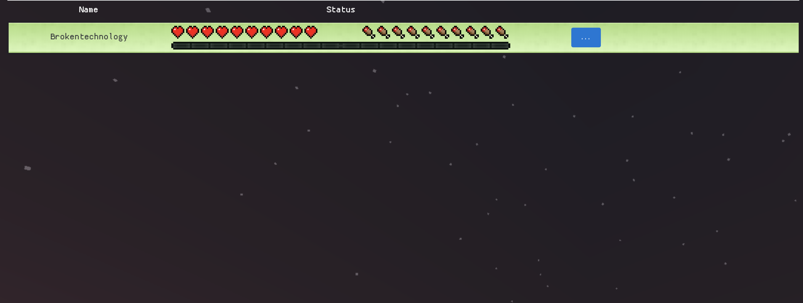

# Parthenon
Parthenon is a prototype web application and plugin for viewing Minecraft user status on a spigot server.

This project is still very early in development, so some features are incomplete or expected to change.



## Requirements:
- spigot 1.10.2-R0.1-SNAPSHOT
- Minecraft 1.10 client

## Current Features:
- See player health.
- See player food.
- View player inventory (some items do not load).
- See if player is alive/dead by highlighted color:
    - Green for alive.
    - Red for dead.
- See if player is offline (grey highlight).

## Future Features:
- Stop/Start/Restart Minecraft server.
- Complete inventory items. 

## Building Parthenon:
- Build Client
```
cd client
bower install
```

- Build Common 
```
cd common
mvn install
```

- Build Server
```
cd server
mvn install
```

## Running Parthenon:
- Running Client
```
mvn jetty:run
```

- Running Server
```
cd server/target
java -jar server-1.0-SNAPSHOT.jar
```
